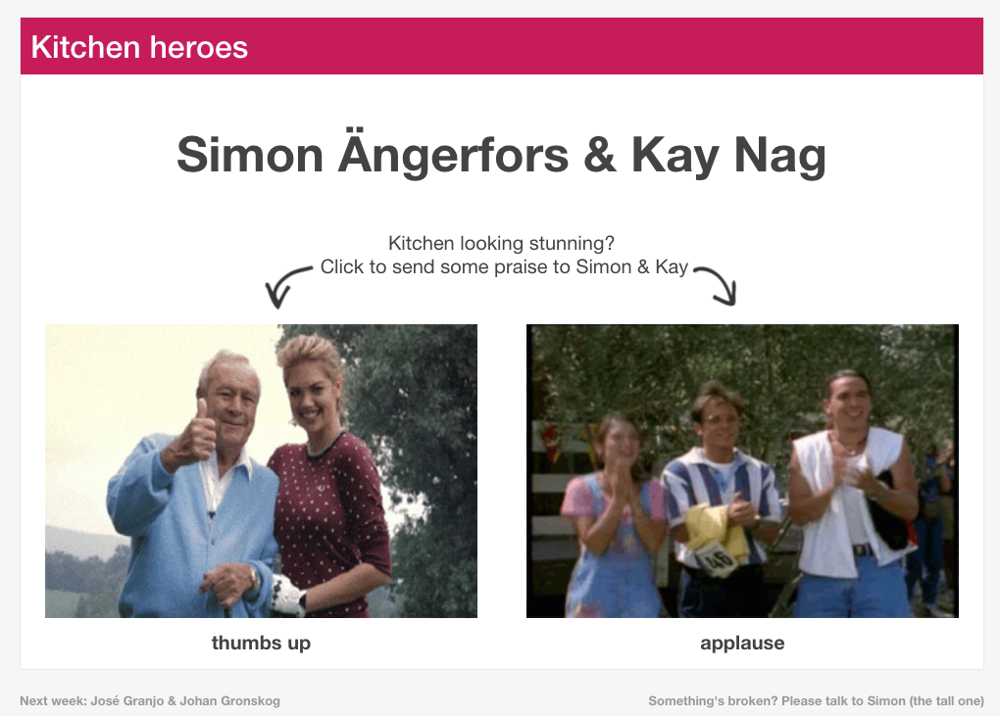
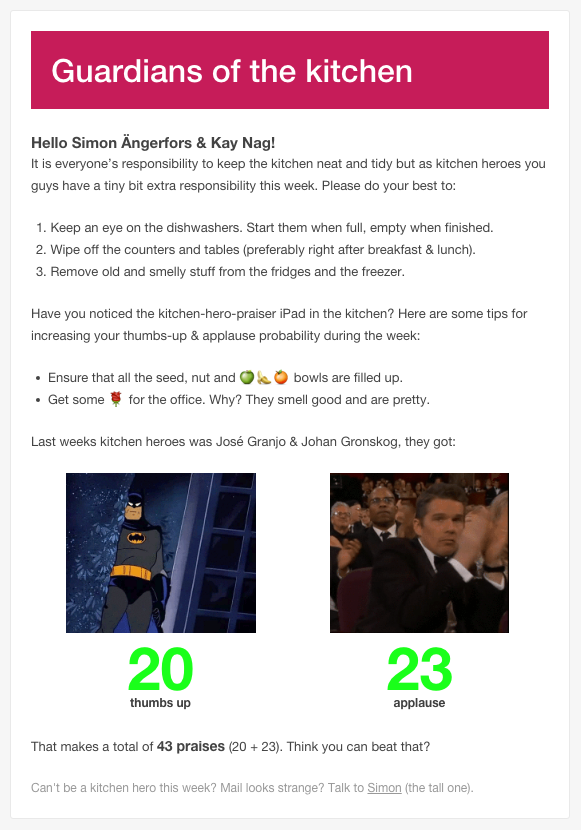
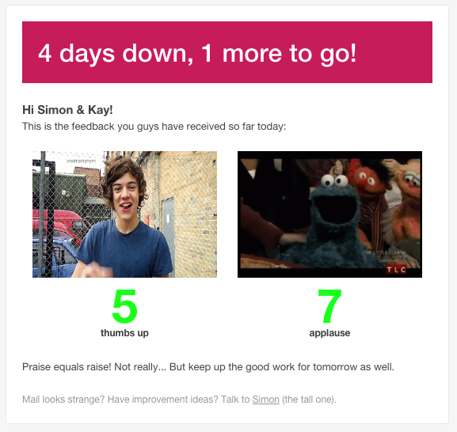
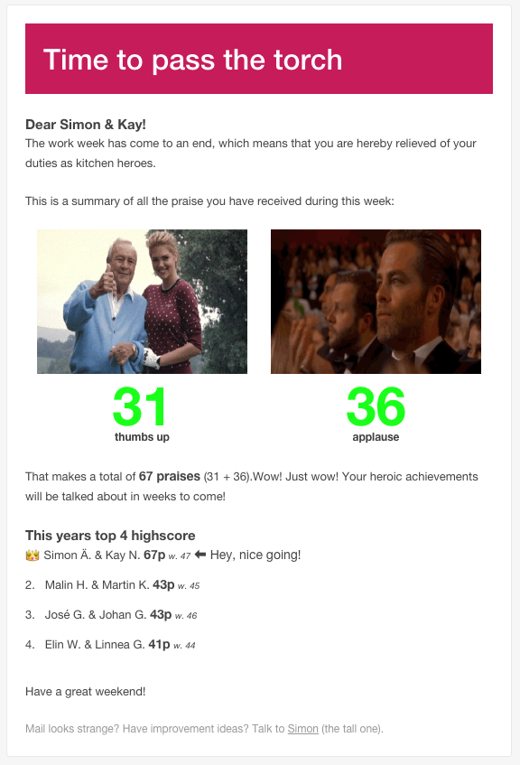

# kitchen-heroes

> System for keeping track of and giving praise to the people in charge of the office kitchen.

Built with :heart: and:
* Node.js as backend.
* ES2015 on both front and back-end.
* Heavy use of JavaScript [promises](https://developer.mozilla.org/en/docs/Web/JavaScript/Reference/Global_Objects/Promise).
* Google Spreadsheet as a database.
* Automatically email send outs.

## Screenshots

### iPad
The UI for the iPad that is placed in the kitchen

### Emails
The emails that are sent out to the kitchen heroes

#### Reminder email
Sent out at the beginning of the week

#### Status email
Sent out at the end of the day, Monday - Thursday

#### Summary email
Sent out at the end of the week

